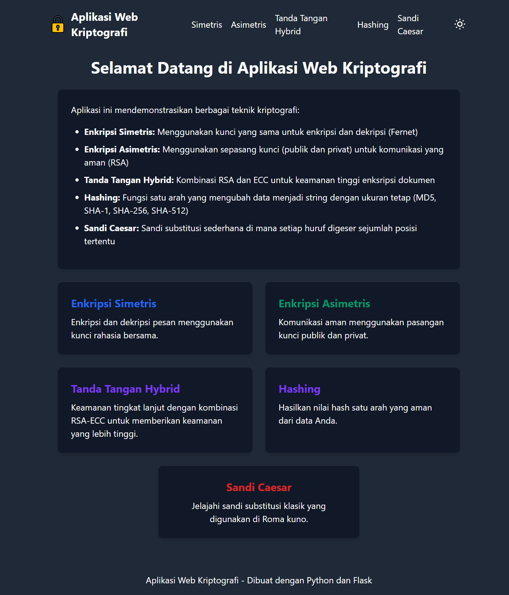

# Aplikasi Web Kriptografi

Aplikasi web ini mendemonstrasikan berbagai teknik kriptografi termasuk enkripsi simetris, asimetris, tanda tangan hybrid, hashing, dan sandi Caesar. Aplikasi ini dibuat menggunakan Python dan Flask.

## Persyaratan

Untuk menjalankan aplikasi ini, Anda memerlukan:

- Python 3.7 atau lebih baru
- Pip (Python package manager)
- Semua dependensi yang tercantum dalam `requirements.txt`

## Instalasi

1. Clone repositori ini atau download sebagai ZIP dan ekstrak
2. Buka terminal dan navigasi ke direktori proyek
3. Buat virtual environment (opsional tapi direkomendasikan):
   \`\`\`
   python -m venv venv
   \`\`\`
4. Aktifkan virtual environment:
   - Windows: `venv\Scripts\activate`
   - macOS/Linux: `source venv/bin/activate`
5. Install dependensi:
   \`\`\`
   pip install -r requirements.txt
   \`\`\`

## Menjalankan Aplikasi

1. Pastikan Anda berada di direktori proyek dan virtual environment aktif
2. Jalankan aplikasi:
   \`\`\`
   python app.py
   \`\`\`
3. Buka browser dan akses `http://127.0.0.1:5000/`

## Fitur Utama

### 3. Tanda Tangan Hybrid

Tanda tangan hybrid mengkombinasikan RSA dan ECC untuk keamanan tinggi.

#### Menandatangani Dokumen:
1. Buka halaman Tanda Tangan Hybrid
2. Klik "Buat Pasangan Kunci RSA & ECC"
3. Pilih dokumen yang ingin ditandatangani
4. Klik "Tandatangani Dokumen"
5. Download file metadata dan dokumen terenkripsi

#### Verifikasi Dokumen:
1. Buka tab "Verifikasi Dokumen"
2. Upload dokumen terenkripsi
3. Upload file metadata
4. Klik "Verifikasi Dokumen"
5. Sistem akan menampilkan hasil verifikasi

## Teknologi yang Digunakan

- **Python**: Bahasa pemrograman utama
- **Flask**: Web framework
- **ECDSA**: Library untuk tanda tangan digital berbasis kurva eliptik
- **Hashlib**: Library untuk fungsi hashs

## Catatan Keamanan

Aplikasi ini dibuat untuk tujuan pendidikan dan demonstrasi. Beberapa catatan keamanan:

- Jangan gunakan kunci yang dihasilkan untuk data sensitif di lingkungan produksi
- MD5 dan SHA-1 dianggap tidak aman untuk aplikasi kriptografi modern
- Sandi Caesar sangat mudah dipecahkan dan tidak boleh digunakan untuk keamanan nyata
- Dalam aplikasi nyata, kunci privat harus disimpan dengan aman dan tidak boleh dibagikan

## Lisensi

Proyek ini dilisensikan ©17.6A.27.
